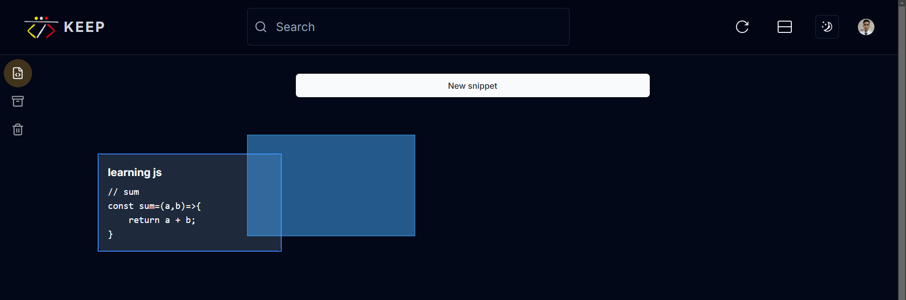

# Keep Code

Effortlessly store, manage, and retrieve your code snippets your web browser. [https://keep-code.vercel.app/](https://keep-code.vercel.app/)

## Install

```bash
git clone https://github.com/brandonporcel/keep-code.git
cd keep-code
npm install
npm run dev
```

## To-Do

- [ ] Implement validation to handle user creation webhook to avoid errors during snippet creation after signup
- [ ] handle auth cookies
- [ ] Manage authentication cookies
- [ ] Add animations using Framer Motion
- [ ] Create a custom 404 page
- [ ] Implement skeleton loading or suspense for items
- [ ] Enhance accessibility: ensure CRUD operations can be performed using keyboard shortcuts and verify speech assistance
- [ ] Show a confirmation alert when closing the page during a save operation
- [ ] Develop an offline version with toast notifications
- [ ] Improve responsive user experience
- [ ] Add vscode styles (by themes and languages)

#### Short log

If you have some time, [brandonporcel.hashnode.dev/keep-code](https://brandonporcel.hashnode.dev/keep-code)

## Contributing

Contributions are always welcome! Feel free to submit issues or pull requests.

## Feedback

I’d love to hear your thoughts! Contact me via [mail](brandon7.7porcel@gmail.com) or [linkedin](https://www.linkedin.com/in/brandonporcel/)

<!-- HAS HELP ME
https://pagination-with-ssg.vercel.app/
special props to https://zistapp.xyz/
https://github.com/Aslam97/shadcn-minimal-tiptap
https://github.com/hunghg255/reactjs-tiptap-editor
https://editorjs.io/
https://github.com/abul2285/next-block-editor-app
https://quilljs.com/
https://highlightjs.org/
https://prismjs.com/
https://codemirror.net/
https://github.com/itsMapleLeaf/dnd-kit-masonry-demo/tree/framer-motion
https://github.com/suyeonme/google-keep-clone
 -->
